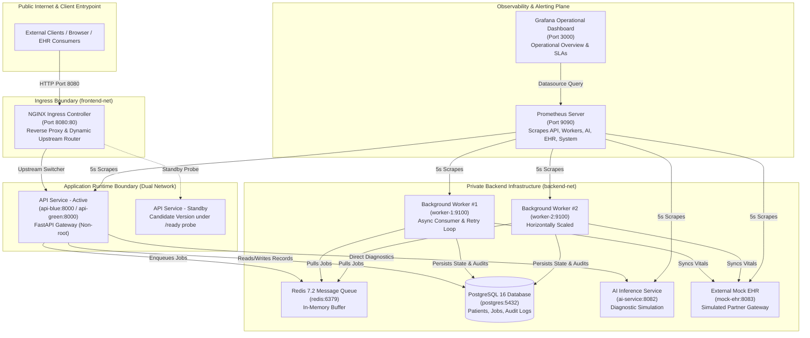

# Master Architecture & System Design Document

**Platform:** Simulated AI-Powered Healthcare Cloud Platform  
**Target Duration & Scope:** Production-Style Simulation across Containers, IaC, CI/CD, Observability & Resilience  
**Author / Engineer:** Cloud & DevSecOps Engineering Team  

---

## 1. Executive Summary & Project Objectives

An end-to-end, production-style cloud engineering and operations simulation designed to run a secure, resilient, observable, and scalable healthcare platform. The project addresses all requirements defined in the Project_Requirements.pdf, focusing on Infrastructure as Code, DevSecOps pipelines, zero-downtime deployments, proactive observability, and strict security and failure isolation boundaries.

### Project Objectives:
- Implement a fully reproducible infrastructure using Docker and Terraform.
- Establish strict network boundaries (public ingress vs. private backend).
- Ensure security through automated pipeline scanning and non-root execution.
- Maintain high availability via Blue-Green deployment and zero-downtime shifting.
- Implement comprehensive observability using Prometheus and Grafana.
- Verify system resilience against component failures (SPOF analysis & Chaos Engineering).

---

## 2. Complete System Architecture Diagram

---

## 3. Components Architecture

The architecture adheres strictly to the principle of **least privilege and zero unnecessary exposure**:

| Network Zone | Docker Bridge Network | Permitted Services | Exposure to Host / Internet | Rationale |
|---|---|---|---|---|
| **Public Ingress** | `frontend-net` | `healthcare-nginx` | Port `8080:80` | Only the reverse proxy accepts external connections. Encapsulates TLS termination, rate-limiting, and path routing. |
| **Bridges (Gateway)** | `frontend-net` + `backend-net` | `api-blue` / `api-green` | None (Internal only) | The API gateway connects to NGINX via `frontend-net` and securely routes to databases and queues via `backend-net`. |
| **Private Backend** | `backend-net` | `postgres`, `redis`, `worker-1`, `worker-2`, `ai-service`, `mock-ehr`, `prometheus`, `grafana` | **Strictly Blocked** (No host ports bound) | Databases and queues must never receive direct public internet traffic. Isolating them prevents brute force, unauthorized queries, and port scanning. |

---

## 4. Infrastructure and Terraform Architecture

| Technology | Purpose | Problem Solved | Trade-Off & Alternative Considered |
|---|---|---|---|
| **Terraform** | Infrastructure as Code | Parameterized, repeatable multi-environment deployments (`dev` vs `prod`). | *Trade-off:* Adds state file management overhead vs raw Compose, but guarantees declarative drift detection. |
| **NGINX** | Reverse Proxy & Traffic Shifting | Dynamic upstream routing for zero-downtime Blue-Green releases. | *Trade-off:* Requires config file rewrites and reloads vs service mesh (Envoy/Istio), but avoids immense operational complexity. |
| **Redis** | In-Memory Message Broker | Asynchronous decoupling of public API requests from slow external EHR syncs. | *Trade-off:* In-memory broker has potential loss risk under hardware failure compared to Kafka/RabbitMQ, but delivers ultra-low latency and simpler operations. |
| **PostgreSQL** | Relational Database | Stores persistent state, audit logs, and patient records securely. | Private by design; prevents external internet access to sensitive healthcare data. |

### Recreation vs State Recovery
A resilient cloud engineering posture differentiates between **ephemeral compute** and **persistent state**:
- **Recreate Infrastructure:** Fully automated via Terraform. Network bridges regenerated, containers rebuilt from images, and Ingress reset.
- **Recover Persistent State:** Restore latest DB snapshot (`pg_dump` and PITR) to recreate volumes.

---

## 5. Blue-Green Deployment & Traffic Shifting

Releases are executed through the automated deployment controller (`deploy.py`):
1. **Standby Spawning**: Standby container (`api-green`) is spun up with the candidate release version.
2. **Readiness Probing**: Container `/ready` probe tests live connections to PostgreSQL and Redis.
3. **Zero-Downtime Traffic Shift**: Upstream is updated in `upstream.conf` and NGINX receives hot reload (`nginx -s reload`). Active client TCP sockets remain open without dropping requests.
4. **Automated Rollback Circuit Breaker**: If candidate readiness fails, rollout halts immediately, the unhealthy container is deleted, and production traffic remains on `api-blue` with zero customer disruption.

---

## 6. Observability: Prometheus, Grafana and Alerting

- **Prometheus** (Port 9090): Collects metrics via 5s pull-based scrapes from API, Workers, AI Service, Mock EHR, and system endpoints. Hosts alerting rules (e.g., `WorkerUnavailable`, `EHRFailureRateHigh`, `QueueBacklogSpike`).
- **Grafana** (Port 3000): Operational dashboards pre-provisioned to display real-time active workers, queue depths, error rates, and request latencies.
- Observability Plane is out-of-band; monitoring crashes do not block or degrade patient transactions.

---

## 7. Security Architecture

1. **Non-Root Execution**: Every microservice is built with an explicit unprivileged user (`RUN adduser -u 10001 -S appuser && USER appuser`).
2. **Secrets Management**: Zero hardcoded passwords. Credentials are injected via `.env` or `*.tfvars`. Secret-bearing configuration files are validated by CI/CD secret scanner.
3. **Automated Security Validation Gates (CI/CD)**:
   - Secret scanning catches committed credentials.
   - Container linter blocks Dockerfiles without non-root directives.
   - Network auditor verifies private resources do not expose ports to `0.0.0.0`.
4. **Database Privacy**: PostgreSQL (`5432`) is only addressable via Docker internal DNS within `backend-net`, strictly blocked from host network.

---

## 8. SPOF Analysis and Disaster Recovery

### SPOF Matrix
| Component | Failure Mode | Impact | Mitigation | Risk Severity |
|---|---|---|---|:---:|
| **API Service** | Container crash, 500s | Degradation | Blue-Green instances; NGINX `max_fails=2` shifts traffic to standby. | Low |
| **Background Worker** | Exception or OOM | Jobs accumulate | Horizontal scaling; decoupled Redis queue retains jobs. Alert fires. | Low |
| **PostgreSQL** | Corrupted data volume | Read/writes fail | Persistent Docker volume. Daily snapshots and PITR strategy. | High |
| **Mock EHR** | Upstream timeout/500 | Vitals sync rejected | Capped exponential retry loop (`max_retries = 3`); Dead-Letter Queue. | Low |

### Disaster Recovery
- **RPO:** < 15 minutes. **RTO:** < 5 minutes.
- **Backup:** Automated logical backups via `pg_dump` to offsite encrypted storage.
- **Restore:** Recreate storage via Terraform (`terraform apply -target=module.storage`), spin up postgres, and `pg_restore` from latest snapshot.

---

## 9. Operational Runbook

| Operation | Command | Expected Result |
|---|---|---|
| **Start Environment** | `docker compose up -d` | All 7 containers running and healthy. |
| **Terraform Deploy** | `terraform apply -var-file="environments/dev/dev.tfvars"` | Declarative creation of infrastructure state. |
| **CI/CD Pipeline** | `python ci/run-pipeline.py` | Runs all 5 DevSecOps gates. Exits with 0 if clean. |
| **Blue-Green Deploy** | `python deployment/scripts/deploy.py --version v1.1.0` | Spawns Green, tests readiness, reloads NGINX upstream. |
| **Automated Rollback** | `python deployment/scripts/deploy.py --simulate-failure` | Rollout fails, candidate destroyed, traffic stays on Blue. |
| **Chaos Simulator** | `python simulation/chaos_simulator.py --scenario all` | Tests EHR outage retries and Worker crash auto-scaling. |
| **Automated Workload** | `python simulation/workload/test_transaction.py` | Submits job, polls Redis queue, validates success. |

---

## 10. Requirement Traceability (Definition of Done)

| Area | Implementation Evidence | Status |
|---|---|:---:|
| **Infrastructure** | Modular Terraform (`modules/network`, `storage`, `services`, `monitoring`) + Compose | **DONE** ✅ |
| **Networking** | Dual bridges (`frontend-net` vs `backend-net`); DB & Redis private (no host port maps) | **DONE** ✅ |
| **Security** | `secret_scanner.py`, `dockerfile_linter.py`, `dependency_auditor.py` in CI/CD pipeline | **DONE** ✅ |
| **Containers** | Every microservice enforces `USER appuser:10001` with multi-stage builds | **DONE** ✅ |
| **CI/CD** | `ci/run-pipeline.py` & `.github/workflows/ci-cd.yml` with 5 automated gates | **DONE** ✅ |
| **Deployment** | `deploy.py` hot-reloads NGINX upstreams; auto-rolls back if candidate checks fail | **DONE** ✅ |
| **Reliability** | Capped exponential retry backoff, DLQ, and dual worker pools | **DONE** ✅ |
| **Observability** | Prometheus (5 alert rules) + pre-provisioned Grafana operational overview | **DONE** ✅ |
| **Recovery** | RPO < 15m, RTO < 5m, pg_dump & PITR | **DONE** ✅ |
| **Auditability** | JSON structured audit logs in PostgreSQL `audit_logs` table | **DONE** ✅ |
| **Documentation** | Master Architecture, Incident Post-Mortem, DR/SPOF Analysis | **DONE** ✅ |
| **Demonstration** | Fully scripted CLI in runbook and automated workloads | **DONE** ✅ |

