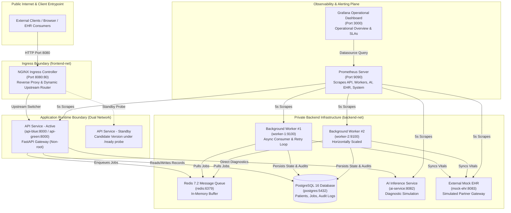

# Master Architecture & System Design Document

**Platform:** Simulated AI-Powered Healthcare Cloud Platform  
**Target Duration & Scope:** Production-Style Simulation across Containers, IaC, CI/CD, Observability & Resilience  
**Author / Engineer:** Cloud & DevSecOps Engineering Team  
**Compliance Reference:** Sections 3, 4, 8, 9, 10, 24, 25 of [Project_Requirements.pdf](file:///c:/Users/yadid/OneDrive/Desktop/projects/Cloud-Infra-Simulation-for-HealthCare-Platform/Project_Requirements.pdf)  

---

## 1. System Topology & Primary Architecture

---

## 2. Trust Boundaries & Network Segmentation

The architecture adheres strictly to the principle of **least privilege and zero unnecessary exposure**:

| Network Zone | Docker Bridge Network | Permitted Services | Exposure to Host / Internet | Rationale |
|---|---|---|---|---|
| **Public Ingress** | `frontend-net` | `healthcare-nginx` | Port `8080:80` | Only the reverse proxy accepts external connections. Encapsulates TLS termination, rate-limiting, and path routing. |
| **Bridges (Gateway)** | `frontend-net` + `backend-net` | `api-blue` / `api-green` | None (Internal only) | The API gateway connects to NGINX via `frontend-net` and securely routes to databases and queues via `backend-net`. |
| **Private Backend** | `backend-net` | `postgres`, `redis`, `worker-1`, `worker-2`, `ai-service`, `mock-ehr`, `prometheus`, `grafana` | **Strictly Blocked** (No host ports bound) | Databases and queues must never receive direct public internet traffic. Isolating them prevents brute force, unauthorized queries, and port scanning. |

### Why is the Database Private?
Healthcare workloads are subject to HIPAA and data protection mandates. Direct database exposure invites automated port scanning, unauthorized credential stuffing, and unmonitored exfiltration. PostgreSQL (`5432`) is only addressable via Docker internal DNS within `backend-net`.

---

## 3. Security Architecture & Identity

1. **Non-Root Execution**:
   Every microservice (`services/api`, `services/worker`, `services/mock-ehr`, `services/ai-service`) is built with an explicit unprivileged user (`RUN adduser -u 10001 -S appuser && USER appuser`). In the event of a remote code execution vulnerability, the attacker cannot modify system binaries or access the host.
2. **Secrets Management**:
   - Zero hardcoded passwords or API tokens exist in version control.
   - Credentials are injected via environment variables at runtime (`.env` or Terraform `*.tfvars`).
   - All secret-bearing configuration files (`.env`, `*.tfvars`, `*.key`) are enforced in [.gitignore](file:///c:/Users/yadid/OneDrive/Desktop/projects/Cloud-Infra-Simulation-for-HealthCare-Platform/.gitignore) and validated by our automated CI/CD secret scanner.
3. **Automated Security Validation Gates (CI/CD)**:
   - Secret scanning catches committed credentials.
   - Container linter blocks Dockerfiles without non-root directives.
   - Network auditor verifies private resources do not expose ports to `0.0.0.0`.

---

## 4. Technology Selection & Trade-Off Analysis

| Technology | Purpose | Problem Solved | Trade-Off & Alternative Considered |
|---|---|---|---|
| **Terraform** | Infrastructure as Code | Parameterized, repeatable multi-environment deployments (`dev` vs `prod`). | *Trade-off:* Adds state file management overhead vs raw Compose, but guarantees declarative drift detection. |
| **NGINX** | Reverse Proxy & Traffic Shifting | Dynamic upstream routing for zero-downtime Blue-Green releases. | *Trade-off:* Requires config file rewrites and reloads vs service mesh (Envoy/Istio), but avoids immense operational complexity. |
| **Redis** | In-Memory Message Broker | Asynchronous decoupling of public API requests from slow external EHR syncs. | *Trade-off:* In-memory broker has potential loss risk under hardware failure compared to Kafka/RabbitMQ, but delivers ultra-low latency and simpler operations. |
| **Prometheus** | Metrics Collection & Alert Engine | Pull-based real-time telemetry and rule evaluation every 5s. | *Trade-off:* Pull architecture requires scrapable endpoints, but eliminates agent installation and complex push gateways. |
| **Grafana** | Operational Visualization | Pre-provisioned dashboards with zero manual configuration. | *Trade-off:* Requires dedicated container, but provides industry-standard executive visibility. |

---

## 5. Deployment & Release Safety (Blue-Green Architecture)

Releases are executed through the automated deployment controller ([deployment/scripts/deploy.py](file:///c:/Users/yadid/OneDrive/Desktop/projects/Cloud-Infra-Simulation-for-HealthCare-Platform/deployment/scripts/deploy.py)):
1. **Standby Spawning**: Standby container (`api-green`) is spun up with the candidate release version.
2. **Readiness Probing**: Container `/ready` probe tests live connections to PostgreSQL and Redis.
3. **Zero-Downtime Traffic Shift**: Upstream is updated in `upstream.conf` and NGINX receives hot reload (`nginx -s reload`). Active client TCP sockets remain open without dropping requests.
4. **Automated Rollback Circuit Breaker**: If candidate readiness fails, rollout halts immediately, the unhealthy container is deleted, and production traffic remains on `api-blue` with zero customer disruption.
.